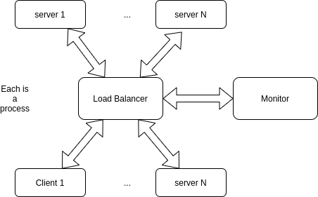

# AS_Proj3

 
 

 
 

## Messages

- Monitor and LB connect first
- Server starts and asks id to monitor.
- monitor tells LB about new server
- monitor sends heartbeats to each server
- client connects
- clients sends req to LB
- LB chooses server and sends req
- LB informes Monitor that req was send to server
- server sends response to LB
- LB informes Monitor about response
- LB sends response to client